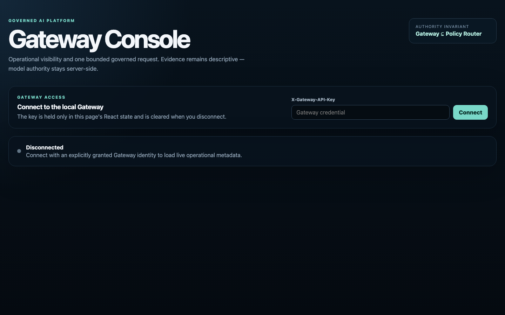
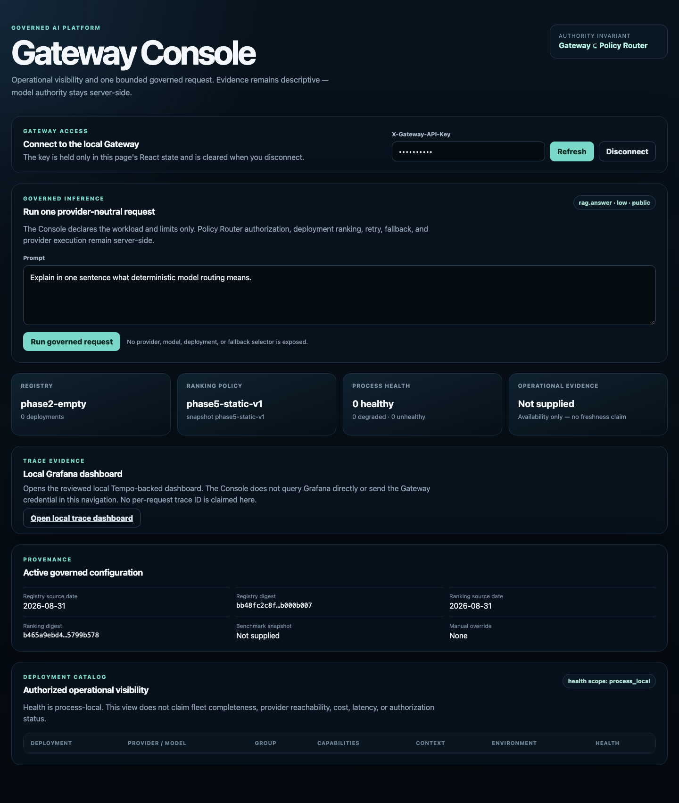
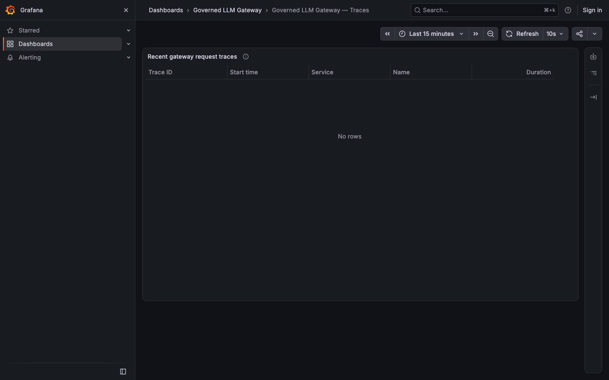

# Governed LLM Gateway

**English** | [Português (Brasil)](README.pt-BR.md)

[](https://github.com/brunovicco/governed-llm-gateway/actions/workflows/quality.yml)
[](https://github.com/brunovicco/governed-llm-gateway/actions/workflows/console-quality.yml)
[](https://github.com/brunovicco/governed-llm-gateway/actions/workflows/observability-compose.yml)

> A provider-neutral LLM execution gateway that keeps **authorization, model selection, provider credentials, resilience and runtime evidence** out of application code.

Applications and agents call one governed execution boundary instead of embedding OpenAI, Anthropic, Gemini, NVIDIA, Groq or OpenRouter-specific credentials and routing logic in every service.

```text
Application / Agent
        │
        │ workload + requirements + Gateway credential
        ▼
Policy Model Router (PDP)
        │ authorized logical model groups
        ▼
Governed LLM Gateway (PEP)
        ├─ eligibility + deterministic ranking
        ├─ health / circuit breaker
        ├─ bounded retry + safe fallback
        ├─ provider translation
        └─ provenance + OpenTelemetry
        ▼
LLM providers
```

The permanent authority rule is:

```text
Gateway allowed set ⊆ Policy Router authorized set
```

The Gateway may narrow an authorized set. It may never widen upstream authorization.

## One real governed request

The caller declared only `workload`, `risk_level` and `data_classification`. The Policy Model Router authorized the `balanced` model group, the Gateway's deterministic ranking selected the deployment inside it, and the provider call, retry/fallback budget and trace emission all stayed server-side.


A real local run of the [`personal-default`](config/profiles/personal-default/README.md) profile with operator-supplied provider credentials — not a mockup and not a stub. Every field is terminal execution evidence: routing and policy decision IDs, registry and ranking digests, the score snapshot that ranked the candidates, the fallback sequence actually taken, and the trace ID the Gateway emitted. The Console's own *View this request's trace in Grafana* link resolves to that exact trace — the matching Grafana waterfall is in [`docs/project/GATEWAY_CONSOLE.md`](docs/project/GATEWAY_CONSOLE.md). What this run does **not** claim is in [Non-claims](#non-claims).

## What this project demonstrates

The repository is a practical reference implementation of an AI Platform execution layer rather than a thin multi-provider proxy.

| Area | Demonstrated capability |
| --- | --- |
| **AI Platform architecture** | Provider-neutral contracts, model registry, explicit composition roots and thin consumer SDK |
| **Governed execution** | PDP/PEP separation, deterministic authorization boundary and fail-closed behavior |
| **Model routing** | Capability/environment filtering, deterministic ranking and route explainability |
| **Reliability** | Runtime health, circuit breaking, bounded retry, safe fallback, streaming and cancellation |
| **LLM interoperability** | Native OpenAI Responses, Anthropic Messages, Gemini and explicit OpenAI-compatible adapters |
| **Structured model I/O** | Structured-output validation and normalized tool-call contracts without taking ownership of tool execution |
| **Observability** | Metadata-only OpenTelemetry, real Collector → Tempo proof and file-provisioned Grafana trace dashboard |
| **Evaluation** | Deterministic benchmark contracts, immutable evidence and explicit promotion/rollback boundaries |
| **Security** | Server-side provider secrets, client authentication boundaries, secret scanning and no allow-all fallback |
| **Engineering quality** | Strict typing, architecture checks, security gates, automated tests and real-container CI proofs |

## How governed execution works

A request does not simply choose the cheapest or fastest available model.

1. The consumer authenticates to the Gateway.
2. The Policy Model Router determines the logical model groups the workload is authorized to use.
3. The Gateway intersects that authority with registry capability, environment, data/risk and runtime eligibility.
4. Deterministic ranking operates only inside that remaining set.
5. Retry/fallback may move only to another already-authorized eligible deployment.
6. Provider-specific requests/responses are normalized behind adapters.
7. Terminal execution provenance and metadata-safe telemetry describe what happened; they never authorize a future request.

Business tool execution remains outside the Gateway. The Gateway can normalize a tool call, but the application/agent runtime owns tool authorization and side effects.

An optional governance authority can only narrow what the Policy Model Router (PDP) authorizes; the Gateway (PEP) executes only inside that already-narrowed set, normalizes the provider call, and fans out metadata-only telemetry (OTel Collector → Tempo → Grafana) and evaluation evidence alongside the actual provider request. See [`docs/architecture/PDP_PEP_CONTRACT_DRAFT.md`](docs/architecture/PDP_PEP_CONTRACT_DRAFT.md) for the exact wire contract.

The Gateway is intentionally **not** an agent framework, RAG framework, MCP tool executor, prompt-management platform or general API-management product. Its responsibility is governed model resolution and execution.

### The secret model

**Never put real API keys in Model Registry files, provider-runtime JSON, README files, logs, traces or Git.** Provider credentials belong to the **Gateway deployment**, never to consumer applications: a provider-runtime binding references a credential by name, and a server-side secret resolver turns that reference into the real value only inside the Gateway process — a sourced `.env` locally, or the same environment references injected by a real secret manager (AWS Secrets Manager, Azure Key Vault, GCP Secret Manager, Vault, ...) in a real deployment.

A consumer application receives only two variables, never a provider key, and owns no provider/model selection or retry/fallback policy: `GOVERNED_LLM_GATEWAY_URL` and `GOVERNED_LLM_GATEWAY_API_KEY`. See [`docs/project/PROVIDER_RUNTIME_CONFIGURATION.md`](docs/project/PROVIDER_RUNTIME_CONFIGURATION.md) and [`docs/project/GATEWAY_CLIENT_AUTHENTICATION.md`](docs/project/GATEWAY_CLIENT_AUTHENTICATION.md) for the detailed trust boundary.

## What you can run today

### 1. Bounded local platform demo — ready now

The repository includes a deterministic one-command **operations-only** local demo that starts:

- the read-only Gateway Operations API;
- the React/TypeScript Gateway Console;
- OpenTelemetry Collector;
- Tempo;
- Grafana with the provisioned Gateway trace dashboard.

It requires **no provider API key and no Policy Router credential** because it deliberately exposes no inference route. This makes the platform/control/evidence surfaces demonstrable without introducing a fake allow-all authorization path.

Real screenshots from this exact demo, captured against a live local run (not mockups):

| Console — before connecting | Console — connected, operations-only baseline (no inference route) |
| --- | --- |
|  |  |

The connected view is the real fail-closed baseline, not a staged one — `phase2-empty` registry, `0 deployments` (see [Non-claims](#non-claims)).



The real, queryable local Grafana/Tempo dashboard shows no rows here because this demo mode exposes no inference route to generate a trace — see [`live-development`](config/profiles/live-development/README.md) or [`personal-default`](config/profiles/personal-default/README.md) for a request that actually produces one.

### 2. Governed live inference — explicit development profile

The checked-in default deployment baseline remains intentionally fail-closed:

- `config/model_registry.yaml` has no enabled deployments;
- `config/providers/runtime.json` has no provider bindings;
- `config/policy/router.json` is disabled;
- checked-in default client-auth artifacts contain no live principals/secrets.

Therefore **adding `OPENAI_API_KEY` or another provider key by itself still does not enable live inference**.

For an explicit opt-in path, `config/profiles/live-development/` provides a reviewed secret-free profile for one `development` / `public` / `rag.answer` consumer with an external Policy Model Router boundary, deterministic ranking, and two native provider deployments in the same authorized `balanced` group. See [its README](config/profiles/live-development/README.md) for the startup/request flow — it is a development/demo configuration, not a production TLS/IAM/SLA claim, and required CI stays credential-free.

This separation is intentional: operational availability never becomes authorization by accident.

### 3. Your own project — the personal-default profile

`config/profiles/personal-default/` is the profile for calling the Gateway from your own applications, not a reviewed demo. It wires six providers (NVIDIA, Gemini, OpenAI, Anthropic, Groq, OpenRouter) into the same authorized group, with NVIDIA cost-preferred as the practical default; deterministic ranking with bounded fallback picks whichever authorized deployment is actually eligible. Your application only ever declares `workload`, `risk_level` and `data_classification`. See ["Quick start: call the Gateway from your own project"](#quick-start-call-the-gateway-from-your-own-project) below and [its README](config/profiles/personal-default/README.md) for the full scope and per-provider proof status.

## Current status

| Track | Status |
| --- | --- |
| Core platform — Phases 0–13 | **Complete** |
| Real-project integrations — Phase 14 | **In progress**: two integrations complete; OpsLens intentionally deferred |
| Local operational demo — OR-8 | **Complete** at the bounded operations-only local-demo scope |
| Live-inference development profile | **Implemented in PC-33**, extended to six providers; every deployment individually proven with real credentials (Gemini, OpenAI, Groq, NVIDIA, OpenRouter, Anthropic) — see `docs/project/CHECKPOINT_LOG.md` |
| Personal-default profile (your own projects) | **Implemented**; NVIDIA cost-preferred ranking proven against four other simultaneously-enabled competing providers — see `config/profiles/personal-default/README.md` |
| Broader operational-surface auth/security — OR-9 | **Minimum-appropriate hardening complete** through bounded increments PC-34..PC-51 plus a dedicated gap investigation (see `docs/project/CURRENT_STATE.md`); production IAM/TLS/SSO, session handling, rate limiting and CSRF remain explicit future work, not silently missing |
| Final screenshots/demo/product-readiness validation — OR-10 | **Complete**: reproducible e2e validation, a security review of the session's new code and of the existing HTTP/adapter surface (no findings in either pass), the consolidated [non-claims](#non-claims) section, and real Console/Grafana screenshots of the operations-only demo — see `docs/project/CURRENT_STATE.md` |
| Per-trace Console correlation | **Implemented in PC-52**; proven live against a real captured trace, in the browser, not just the SDK — see `docs/project/CURRENT_STATE.md` |

The authoritative checkpoint is [`docs/project/CURRENT_STATE.md`](docs/project/CURRENT_STATE.md). The
punch list that was still open at the `v1.0.0` cut (opt-in real-provider proof, the Console per-trace
navigation decision, minimum OR-9 hardening, OR-10 validation) is now fully closed — see
[`CHANGELOG.md`](CHANGELOG.md#unreleased) for what each item closed and the PR it shipped in, and
`docs/project/CHECKPOINT_LOG.md` for the dated evidence behind it. This closes the list that was open at
v1.0.0's cut, not the roadmap as a whole — OR-9's production-only scope (TLS/IAM/SSO, session handling,
rate limiting, CSRF) and Phase 14's remaining cases stay open by design; see [Non-claims](#non-claims).
Full roadmap completion also stays sequentially gated: OpsLens must be reconciled before RAGForge and
later integrations start, unless that normative order is explicitly revised.

## Non-claims

Scattered non-claims already exist next to the specific feature they bound (each profile's own README, the OR-9/OR-10 rows above). This section is the single place to read all of them at once.

This repository does **not** claim to be:

- **Production infrastructure.** No TLS termination, no production IAM/OAuth/OIDC/workload identity, no browser session management, no rate limiting, no CSRF policy. OR-9's bounded PC-34–PC-51 hardening narrows specific gaps on the surfaces this repo actually exposes (non-storable responses, header sanitization, bounded bodies); it does not complete any of the above.
- **An SLA or uptime guarantee for any third-party model provider.** Provider pricing/model catalog entries are pinned metadata reviewed as of specific dates (see each profile's README) and can drift from the real provider catalog; NVIDIA/Groq/OpenRouter pricing in `personal-default` is an approximate placeholder pending a separately reviewed update.
- **A benchmark of real production traffic.** Everything in `benchmarks/` runs against public/synthetic fixtures with deterministic scoring, credential-free by default. It is evidence for ranking eligibility inside an already-authorized set, never authorization, and never a substitute for live user feedback.
- **A multi-tenant or remote deployment.** Every demonstrated path (`scripts/local_demo.py`, `live-development`, `personal-default`) runs as local loopback (`127.0.0.1`) processes an operator starts and stops. None of it has been exercised behind a real reverse proxy, load balancer, or public DNS name.
- **A complete Phase 14 rollout.** Two of five planned consumer integrations are complete; OpsLens is a validated-but-deliberately-deferred candidate pending its own repository stabilizing; RAGForge and the Verifiable AI Governance integration have not started, by explicit sequencing decision, not oversight.
- **A finished OR-9.** OR-9 is bounded hardening for the operational surfaces this repo already exposes, not a production security certification. OR-10 (reproducible end-to-end validation, two security-review passes, and real demo screenshots) is complete; OR-9's production IAM/TLS/SSO, session handling, rate limiting and CSRF remain separate future work.

What every governed-inference proof cited in `docs/project/CHECKPOINT_LOG.md` **is**: a real request, with real operator-supplied provider credentials, executed through the full Policy Router → Gateway → provider chain, with the terminal routing/execution evidence inspected — not a mock, not a stub, and not a credential-free simulation.

## Quick start: local operations demo

### Prerequisites

- Python **3.13+** (the workspace currently supports Python 3.13–3.14);
- [uv](https://docs.astral.sh/uv/);
- Docker with Docker Compose;
- Node.js 24 + npm.

### Start

```bash
git clone https://github.com/brunovicco/governed-llm-gateway.git
cd governed-llm-gateway

cp .env.example .env
```

Edit `.env` and set a random local-only value:

```dotenv
GATEWAY_LOCAL_DEMO_API_KEY=replace-with-a-random-local-value
```

The Python runtime does **not** automatically load `.env`. Export it into the process environment before starting:

```bash
set -a
source .env
set +a

uv run --frozen python scripts/local_demo.py
```

When readiness succeeds, open:

| Surface | URL | Purpose |
| --- | --- | --- |
| Gateway Console | `http://127.0.0.1:5173` | Read-only operational view |
| Gateway readiness | `http://127.0.0.1:8000/readyz` | Process readiness |
| Operations API | `http://127.0.0.1:8000/v1/ops/overview` | Authenticated bounded operational state |
| Grafana | `http://127.0.0.1:3000` | Local trace visualization |

Press `Ctrl+C` to stop the interactive demo. The launcher owns cleanup of its child processes and dedicated Compose project.

For an automated startup/readiness/teardown proof:

```bash
uv run --frozen python scripts/local_demo.py --smoke-test
```

For governed provider execution, use the separate [`live-development` profile runbook](config/profiles/live-development/README.md); it intentionally requires an external PDP and server-side provider credentials.

## Quick start: call the Gateway from your own project

This is the actual "no friction" path: your application never picks a provider or model, only a
`workload`. It requires two running processes — the Policy Model Router (a separate repository) and the
Gateway — plus your consumer project pointed at the Gateway's URL and credential.

### 1. Install both services

```bash
git clone https://github.com/brunovicco/governed-llm-gateway.git
cd governed-llm-gateway
uv sync --frozen

git clone https://github.com/brunovicco/policy-model-router.git ../policy-model-router
cd ../policy-model-router
uv sync --frozen
cd ../governed-llm-gateway
```

### 2. Configure

```bash
cp .env.example .env
```

Edit `.env`:

```dotenv
GATEWAY_DEMO_API_KEY=replace-with-a-random-local-value
POLICY_ROUTER_DEMO_API_KEY=replace-with-a-random-local-value
NVIDIA_API_KEY=your-real-nvidia-key
GEMINI_API_KEY=your-real-gemini-key
OPENAI_API_KEY=your-real-openai-key
ANTHROPIC_API_KEY=your-real-anthropic-key
GROQ_API_KEY=your-real-groq-key
OPENROUTER_API_KEY=your-real-openrouter-key
```

`GATEWAY_DEMO_API_KEY`/`POLICY_ROUTER_DEMO_API_KEY` are local shared secrets you invent; the six
provider keys are real credentials (NVIDIA has a free tier at [build.nvidia.com](https://build.nvidia.com)).
A missing key for an **enabled** deployment fails the whole process closed at startup — if you don't
have all six, disable the corresponding deployment(s) in `model_registry.yaml` (`enabled: false`) and
remove the matching binding from `provider_runtime.json` first.

### 3. Start the Policy Router and the Gateway

```bash
cd governed-llm-gateway
set -a; source .env; set +a
uv run --frozen python scripts/personal_default_launcher.py
```

This one command starts both services (assumes `../policy-model-router` from step 1; override with
`POLICY_MODEL_ROUTER_ROOT`) and tears both down on Ctrl+C. See [its README](config/profiles/personal-default/README.md#running-it)
for the two-terminal manual equivalent and the `--smoke-test` switch.

### 4. Call it from your own project

Add the thin client (not published to PyPI; install straight from this repository):

```bash
uv add "governed-llm-gateway-client @ git+https://github.com/brunovicco/governed-llm-gateway.git#subdirectory=packages/gateway-client"
```

Your consumer project needs only two environment variables — never a provider key:

```dotenv
GOVERNED_LLM_GATEWAY_URL=http://127.0.0.1:8000
GOVERNED_LLM_GATEWAY_API_KEY=<the same GATEWAY_DEMO_API_KEY from step 2>
```

```python
import asyncio

from governed_llm_gateway_client import GatewayClient
from governed_llm_gateway_contracts import DataClassification, Message, MessageRole, RiskLevel


async def main() -> None:
    async with GatewayClient.from_env() as gateway:
        response = await gateway.generate(
            workload="rag.answer",
            messages=(
                Message(role=MessageRole.USER, content="Explain deterministic routing in one sentence."),
            ),
            risk_level=RiskLevel.LOW,
            data_classification=DataClassification.PUBLIC,
            context_tokens_estimated=128,
            max_output_tokens=2000,
            provider_timeout_seconds=30.0,
        )

    print(response.content)
    # Decided by the Gateway's ranking, not by your code — NVIDIA under normal conditions,
    # automatically falling back to another authorized provider otherwise.
    print(response.execution.provider, response.execution.model, response.execution.deployment)


asyncio.run(main())
```

`max_output_tokens: 2000` is not arbitrary: NVIDIA, Gemini and Groq's deployments here spend a variable,
sometimes large share of the budget on internal "thinking" before any visible text — a tight budget
like `128` measurably returns empty `response.content` a meaningful fraction of the time (reproduced
directly, not theoretical). Give reasoning-style models real headroom.

No provider SDK, no API key, and no `if provider == ...` branch belongs in your project. See
[its README](config/profiles/personal-default/README.md) for the full runbook, current scope
(`rag.answer` in `balanced`) and per-provider proof status.

## Validate the repository

The default quality path is deterministic and credential-free:

```bash
uv sync --frozen
uv run python scripts/quality_gate.py
```

Frontend, observability and integration proofs are also isolated in dedicated GitHub Actions workflows. Live-provider tests remain opt-in by design.

## Repository map

| Path | Responsibility |
| --- | --- |
| `apps/gateway-api/` | FastAPI composition root and executable Gateway processes |
| `apps/gateway-console/` | Read-only React/TypeScript operational console |
| `packages/gateway-contracts/` | Provider-neutral public contracts |
| `packages/gateway-core/` | Domain, application services and provider/runtime adapters |
| `packages/gateway-client/` | Thin typed consumer SDK |
| `config/` | Secret-free registry, provider, client, policy and routing artifacts |
| `benchmarks/` | Deterministic evaluation and evidence |
| `Dockerfile`, `compose.gateway.yml` | Container image and deployment for the Gateway API |
| `deploy/observability/` | Collector, Tempo and Grafana local provisioning |
| `scripts/` | Quality, evidence and deterministic local-demo tooling |
| `tests/` | Contract tests plus opt-in integration proofs against real servers |
| `docs/` | Architecture, security boundaries, roadmap and evidence contracts |

## Recommended reading

If you are evaluating the repository, start here:

- [`docs/project/CURRENT_STATE.md`](docs/project/CURRENT_STATE.md) — authoritative current checkpoint;
- [`docs/project/CHECKPOINT_LOG.md`](docs/project/CHECKPOINT_LOG.md) — the dated proof-by-proof history behind it;
- [`docs/project/OPERATIONAL_READINESS.md`](docs/project/OPERATIONAL_READINESS.md) — local demo/operations readiness sequence;
- [`config/profiles/live-development/README.md`](config/profiles/live-development/README.md) — governed live-development runbook;
- [`config/profiles/personal-default/README.md`](config/profiles/personal-default/README.md) — how to call the Gateway from your own project, NVIDIA cost-preferred ranking;
- [`docs/architecture/PDP_PEP_CONTRACT_DRAFT.md`](docs/architecture/PDP_PEP_CONTRACT_DRAFT.md) — authorization boundary;
- [`docs/project/PROVIDER_RUNTIME_CONFIGURATION.md`](docs/project/PROVIDER_RUNTIME_CONFIGURATION.md) — provider and secret model;
- [`docs/project/CONTAINER_DEPLOYMENT.md`](docs/project/CONTAINER_DEPLOYMENT.md) — container image and deployment;
- [`docs/project/OPENAI_COMPATIBLE_INGRESS.md`](docs/project/OPENAI_COMPATIBLE_INGRESS.md) — OpenAI-compatible ingress;
- [`docs/project/SHARED_RUNTIME_STATE.md`](docs/project/SHARED_RUNTIME_STATE.md) — shared health and circuit state;
- [`docs/project/SPEND_ACCOUNTING.md`](docs/project/SPEND_ACCOUNTING.md) — estimated spend and budgets;
- [`docs/project/GATEWAY_CONSOLE.md`](docs/project/GATEWAY_CONSOLE.md) — Console boundary;
- [`docs/project/GRAFANA_TRACE_DASHBOARD.md`](docs/project/GRAFANA_TRACE_DASHBOARD.md) — real local Grafana/Tempo proof;
- [`docs/project/EVALUATION.md`](docs/project/EVALUATION.md) — benchmark/evidence architecture;
- [`CHANGELOG.md`](CHANGELOG.md) — what each version includes.

## License

Licensed under the [Apache License, Version 2.0](LICENSE).
