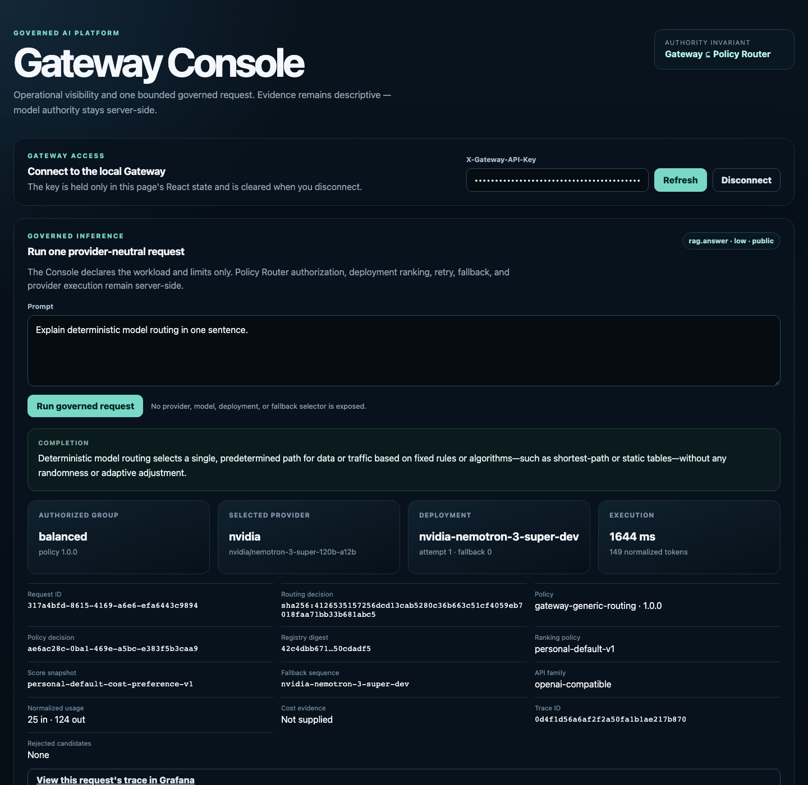
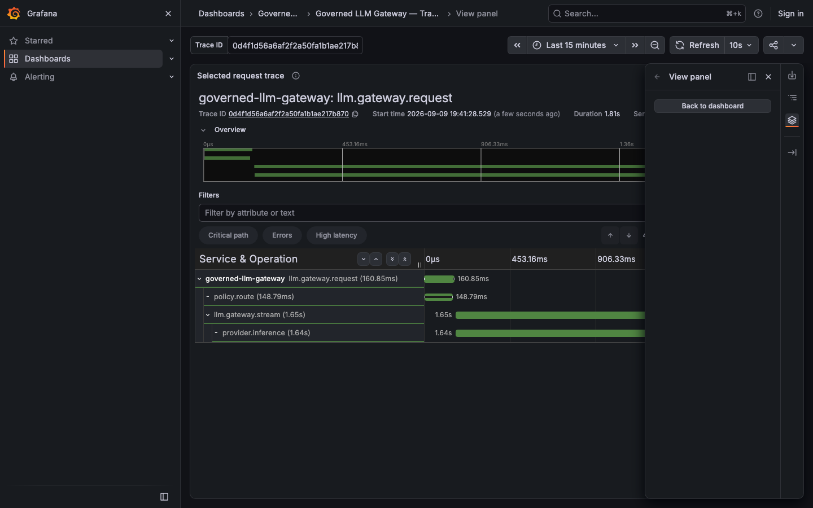

# Gateway Console Foundation

## Purpose

PC-25 / OR-5A introduces the first browser-based operator surface for the Governed LLM Gateway. It is a
read-only consumer of the already-reviewed Operations API; it is not a control plane and it does not
create a new source of truth.

The console consumes only:

```text
GET /v1/ops/overview
GET /v1/ops/deployments
```

The console does not call providers, the Policy Router, Tempo, Grafana, Langfuse, secret stores or
configuration files directly. PC-28 adds navigation to the already-reviewed local Grafana dashboard; it
does not add a Grafana API call or data dependency.

## Technology boundary

The application lives at `apps/gateway-console` and uses pinned React, TypeScript and Vite dependencies.
Frontend CI uses Node.js 24 LTS and a committed npm lockfile.

Development traffic remains same-origin from the browser perspective. Vite proxies `/v1` to the local
Gateway process at `http://127.0.0.1:8000`. Production hosting/BFF/session architecture is deferred.

PC-51 hardens only the reviewed local Vite server response boundary. The Console emits
`Content-Security-Policy: frame-ancestors 'none'` plus `X-Frame-Options: DENY` to reject framing, and also
emits `Referrer-Policy: no-referrer` and `X-Content-Type-Options: nosniff`. No script, style or connect CSP
directive is introduced, so this slice does not redefine Vite HMR/runtime connectivity or claim a
production Content Security Policy. Production TLS and hosting headers remain deployment concerns.

## Local development

Start an already-configured governed Gateway process on loopback port `8000`, then run the console in a
separate shell:

```text
cd apps/gateway-console
npm ci --ignore-scripts
npm run dev
```

Vite serves the console on `http://127.0.0.1:5173` and proxies only `/v1` requests to the local Gateway.
The operator must explicitly enter an identity that has the deployment-owned Operations read grant. No
credential is embedded in the build or supplied through a Vite environment variable.

The PC-28 Grafana navigation is available only from that exact reviewed local Console origin. The target
is derived from the validated origin and resolves to the PC-27 dashboard UID
`governed-llm-gateway-traces` on loopback Grafana port `3000`. No environment variable or arbitrary
external observability URL is introduced.

The Gateway API has no CORS middleware configured, reviewed as part of an OR-9 minimum-hardening pass
over the demonstrated operational surfaces. This is deliberate, not an oversight: the Console only ever
reaches the Gateway through Vite's same-origin `/v1` proxy above, so the browser never makes a genuinely
cross-origin request to it. Absent CORS headers, a browser blocks any other origin from reading a
response even if it can send the request, which is the correct default for a credential-bearing API. Do
not add permissive CORS to the Gateway API without a separately reviewed cross-origin consumer boundary.

## Credential handling

The existing Operations transport still requires:

```text
X-Gateway-API-Key
```

PC-25 deliberately does not invent OAuth, JWTs, cookies or a browser session service. The operator enters
the credential manually and the console keeps it only in React component state for the active page
lifetime. Disconnect clears that state.

The console itself does not write the credential to:

- `localStorage`;
- `sessionStorage`;
- cookies;
- URLs or query strings;
- generated configuration;
- repository files.

PC-28 does not pass the Operations credential or any Operations response data to the Grafana navigation
builder. The generated target has no query string, fragment, userinfo or token. The link opens in a new
tab with `noopener noreferrer` isolation.

This is a local-demo boundary, not the final production identity architecture. External IAM/BFF/session
hardening remains OR-9 work.

## Trusted data boundary

Browser TypeScript types are not treated as runtime validation. PC-25 decodes both Operations responses
with closed-shape runtime validators before rendering them. Unexpected fields, unsupported enum values,
invalid counts, invalid dates, non-positive context windows or disagreement between overview and catalog
sizes fail closed into a bounded console error.

No stale cache or placeholder operational values are rendered while disconnected, loading or failed.
The UI therefore does not fabricate:

- fleet health;
- provider availability;
- latency;
- cost;
- evidence freshness/completeness;
- routing decisions;
- authorization reasons;
- traces.

`process_local` is rendered explicitly for health and must not be relabeled as global/fleet state.

PC-28's dashboard link does not add trace IDs, routing history or a trace list; it navigates to the
existing Grafana dashboard only. PC-52 separately adds one real per-request trace ID and a deep link to
that exact trace — see "Per-request trace navigation" below — without changing this general dashboard
link's own no-trace-claim.

## Read-only authority boundary

The permanent invariant remains:

```text
Gateway allowed set ⊆ Policy Router authorized set
```

Console visibility is independently granted by `OperationsReadAccessService`. The browser cannot authorize
models, widen or restore PDP output, alter eligibility/complexity/ranking, mutate health/circuit state,
change retry/fallback, execute a provider or edit runtime configuration.

The Console contains no control-plane mutation. The frontend boundary check permits only the already
reviewed provider-neutral `POST /v1/generate` inference action and rejects unreviewed POST/PUT/PATCH/DELETE
request literals, arbitrary absolute HTTP URLs and unreviewed `/v1/ops/*` paths in source. PC-28 preserves
the navigation boundary by constructing the local Grafana target only after validating the runtime Console
origin. PC-51 adds browser anti-framing headers without changing any Gateway request or authority surface.

## Local Grafana navigation

PC-28 adds one bounded navigation affordance after a trusted Operations snapshot has loaded. The link is
rendered only when `window.location.origin` exactly matches the reviewed development origin contract:

```text
protocol: http
hostname: 127.0.0.1
port: 5173
```

The URL builder rejects malformed origins plus unexpected protocol, hostname, port, path, query,
fragment or userinfo. It then changes only the port/path needed to reach the already-certified PC-27
Grafana dashboard. Tests cross-check the Console dashboard UID against the checked-in Grafana dashboard
JSON so the navigation cannot silently drift from provisioning.

The Console does not fetch Grafana or Tempo, proxy their APIs, inspect their health, or treat their
availability as Gateway readiness. The link is descriptive local-demo navigation only.

## Per-request trace navigation

PC-52 adds a second, more specific navigation affordance: after a governed request completes with real
OpenTelemetry tracing enabled, the Console renders a "View this request's trace in Grafana" link that
opens the exact trace for that one request, not just the general dashboard.

The trace ID comes from the Gateway's own already-active span for the request, not a client-side guess.
`apps/gateway-api/stream_generate.py` reads the current span's `SpanContext.trace_id` (via
`current_trace_id` in `packages/gateway-core/application/telemetry.py`) only when building the terminal
`RESPONSE_COMPLETED` SSE event, and only when that span context is valid — when observability is
disabled, `execution.trace_id` stays `None` rather than being fabricated. `ProviderExecution.trace_id` is
validated as an exact 32-character lowercase-hex string wherever it is constructed, decoded, or
re-decoded (the Gateway, the Python thin client, and the Console's own SSE decoder each independently
reject anything else).

The deep link itself does **not** use Grafana's Explore view: this local demo's anonymous Viewer role
(`GF_AUTH_ANONYMOUS_ORG_ROLE: Viewer`) does not have Explore access, confirmed by direct testing (Grafana
redirects `/explore` to `/?redirectTo=%2Fexplore` for that role). Instead, the provisioned
`gateway-traces-dashboard.json` gained a second panel, "Selected request trace" (a Tempo `traces` panel
type querying `${traceId}`), fed by a `traceId` textbox dashboard variable. The link sets that variable
and jumps straight to the panel: `/d/<uid>/<slug>?var-traceId=<id>&viewPanel=2`. This reuses the same
reviewed, file-provisioned, `allowUiUpdates: false` dashboard the Console already links to, rather than
introducing a new authorization surface.

Building and proving this end to end surfaced one real infrastructure bug, since fixed: `otel-collector`
in `compose.observability.yml` declared a `127.0.0.1:4318:4318` host port mapping, but its only Docker
network was `observability`, which is `internal: true`. An `internal` network cannot have any of its
containers' ports published to the host — Docker silently drops the mapping rather than erroring — so
`http://127.0.0.1:4318` was unreachable from any host process for as long as this compose file has
existed. Nothing had caught this because the existing credential-free `collector-receipt` CI proof
(`compose.collector-receipt.yml`) uses an entirely separate, non-internal-networked compose file, and no
other workflow sends a real span through this specific stack from a host process. The fix adds
`otel-collector` to the same `grafana-host-access` bridge network `grafana` already uses. See
`docs/project/CHECKPOINT_LOG.md` for the real trace captured proving the fix (Gateway → Collector → Tempo
→ Grafana, rendered waterfall included).

Real screenshots from this exact flow, captured against a live local run (not mockups): the Console after
a real governed request, showing the real `Trace ID` alongside the rest of the terminal evidence and the
"View this request's trace in Grafana" link —



— and the exact same trace ID rendered by Grafana's `Selected request trace` panel after following that link:



## CI

`.github/workflows/console-quality.yml` is credential-free and path-scoped. It requires:

```text
npm ci --ignore-scripts
npm run typecheck
npm test
npm run security:surface
npm run build
```

PC-28 extends deterministic frontend tests for the exact accepted/rejected origin contract and dashboard
UID alignment. PC-51 adds a deterministic configuration contract for the exact local browser hardening
headers while re-locking the loopback host, fixed port and relative `/v1` proxy. PC-52 adds deterministic
tests for the per-trace dashboard deep link (exact `var-traceId`/`viewPanel` construction, trace ID format
rejection, origin rejection) and cross-checks the link's panel ID against the provisioned dashboard JSON,
the same way PC-28 cross-checks the dashboard UID. The existing security-surface check remains unchanged
and continues to reject arbitrary absolute HTTP URLs in Console source.

The workflow is separate from the Python quality gate so frontend toolchain concerns do not weaken or
replace existing Python governance/security gates.

## Deferred

PC-25/PC-28/PC-51/PC-52 do not add:

- production authentication or external IAM;
- a BFF/session service;
- deployment/evidence detail pages;
- recent routing history;
- direct Tempo/Grafana API queries from the Console;
- production Grafana URL discovery or arbitrary external observability URLs;
- broader dashboard navigation;
- control-plane mutations;
- production TLS termination or hosting security policy;
- console Docker packaging;
- one-command demo orchestration;
- Phase 14 consumer integrations.
